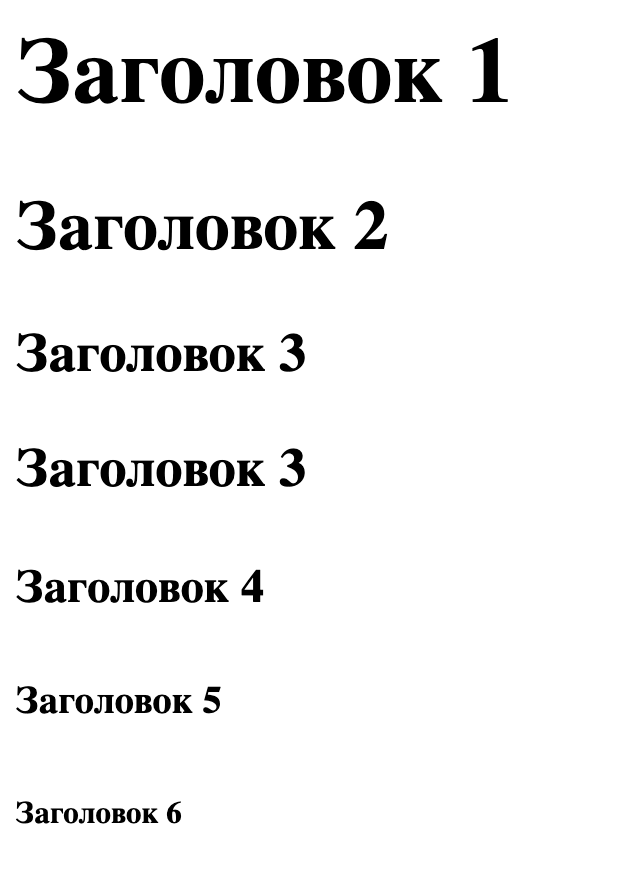

# 01-practice

### Ожидаемый результат


[Интерактивная демонстрация](https://iksergey.github.io/html-handbook/release/01-practice)

### Содержимое файла
[index.txt](./index.txt)

```
Заголовок 1
Заголовок 2
Заголовок 3
Заголовок 3
Заголовок 4
Заголовок 5
Заголовок 6
```
