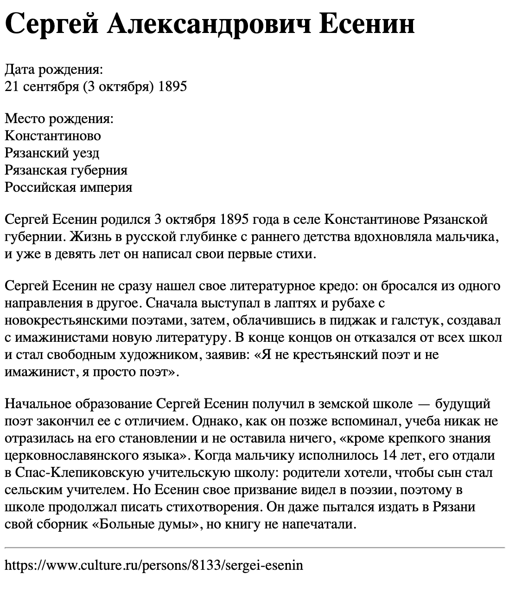

# 03-practice

### Ожидаемый результат


[Интерактивная демонстрация](https://iksergey.github.io/html-handbook/release/03-practice)

### Содержимое файла
[index.txt](./index.txt)

```
Сергей Александрович Есенин

Дата рождения:
21 сентября (3 октября) 1895 
Место рождения:
Константиново
Рязанский уезд
Рязанская губерния
Российская империя

Сергей Есенин родился 3 октября 1895 года в селе Константинове Рязанской губернии. Жизнь в русской глубинке с раннего детства вдохновляла мальчика, и уже в девять лет он написал свои первые стихи.
Сергей Есенин не сразу нашел свое литературное кредо: он бросался из одного направления в другое. Сначала выступал в лаптях и рубахе с новокрестьянскими поэтами, затем, облачившись в пиджак и галстук, создавал с имажинистами новую литературу. В конце концов он отказался от всех школ и стал свободным художником, заявив: «Я не крестьянский поэт и не имажинист, я просто поэт».
Начальное образование Сергей Есенин получил в земской школе — будущий поэт закончил ее с отличием. Однако, как он позже вспоминал, учеба никак не отразилась на его становлении и не оставила ничего, «кроме крепкого знания церковнославянского языка». Когда мальчику исполнилось 14 лет, его отдали в Спас-Клепиковскую учительскую школу: родители хотели, чтобы сын стал сельским учителем. Но Есенин свое призвание видел в поэзии, поэтому в школе продолжал писать стихотворения. Он даже пытался издать в Рязани свой сборник «Больные думы», но книгу не напечатали.

https://www.culture.ru/persons/8133/sergei-esenin
```
