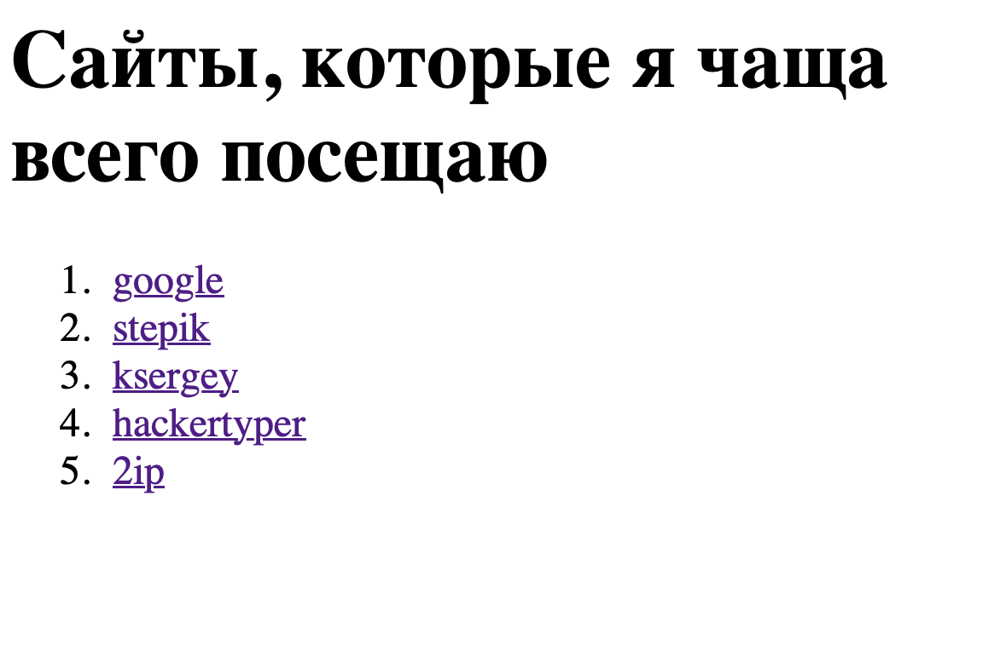

# 05-practice

### Техническое задание

**Цель проекта:**
Научиться создавать список ссылок на часто посещаемые сайты с использованием HTML.

**Требования:**
1. Создать HTML-страницу.
2. Использовать теги `<h1>`, `
`, `<ol>` и `<li>`.
3. Каждая ссылка должна иметь текст, который соответствует названию сайта.
4. Каждая ссылка должна открываться в новой вкладке.

**Описание элементов страницы:**
1. Заголовок первого уровня: `<h1>Сайты, которые я чаще всего посещаю</h1>`
2. Параграф: `
`
   - Используется для обозначения блока ссылок.
3. Нумерованный список: `<ol>`
   - Каждая ссылка будет представлена в виде элемента списка.
4. Элементы списка: `<li>`
   - Каждый элемент списка будет содержать ссылку на сайт.
5. Ссылки: `<a>`
   - Каждая ссылка должна быть активной и открываться в новой вкладке.
   - Атрибут `href` заполняется адресом сайта.
   - Атрибут `target` должен быть установлен в `_blank` для открытия ссылки в новой вкладке.

**Замечания:**
- Не забудьте сохранить файл с расширением `.html`.

### Документация

- [Element a](https://developer.mozilla.org/en-US/docs/Web/HTML/Element/a)
- [Element ol](https://developer.mozilla.org/en-US/docs/Web/HTML/Element/ol)
- [Element ul](https://developer.mozilla.org/en-US/docs/Web/HTML/Element/ul)
- [Element h*](https://developer.mozilla.org/en-US/docs/Web/HTML/Element/Heading_Elements)
- [Element p](https://developer.mozilla.org/en-US/docs/Web/HTML/Element/p)

### Примерный ожидаемый результат

[Интерактивная демонстрация](https://iksergey.github.io/html-handbook/release/05-practice)

### Содержимое файла
[index.txt](./index.txt)
